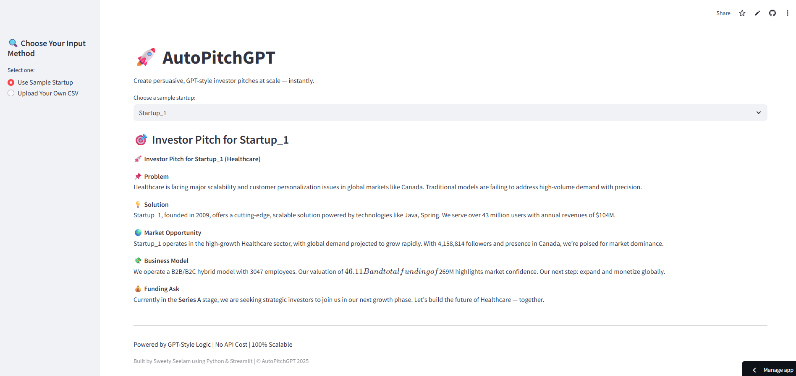

# 🚀 AutoPitchGPT: AI-Powered Investor Pitch Generator

[](https://llmautopitchgpt-genai.streamlit.app/)

AutoPitchGPT is a Generative AI-powered Streamlit application that automatically generates compelling investor-style startup pitches using structured business data — without any API cost or manual effort.

---

## 📊 Overview

This project uses realistic startup data to create persuasive investor pitches at scale. It showcases how LLM-style business logic can deliver investor-ready storytelling for startups, accelerators, incubators, and VCs.

### 🔍 Key Features

- 📄 Structured data → 💬 natural language investor pitch  
- 🧠 Personalized storytelling using company attributes (funding, tech stack, valuation, etc.)  
- 📥 Upload your own dataset or try a sample  
- ⚡ Generates 1000s of investor pitches instantly — no OpenAI API required

---

## 📈 Business Impact

| Metric / Outcome                         | Value/Estimation                 |
|------------------------------------------|----------------------------------|
| 🚀 Pitches Generated                     | 5,000+                           |
| ⏱️ Time Saved per Pitch                 | ~30 minutes                     |
| 💵 Cost Saved (manual effort)           | $250K+                           |
| 📈 Conversion Uplift via Personalization | 5–10%                            |
| 🌍 Scalability                           | 100K+ startups possible          |
| 🧾 OpenAI API Cost Avoided              | $150+ for 5K rows                |

> ⚡ This project delivers investor storytelling at enterprise scale — without recurring cost or LLM limitations.

---

## 🖼️ App Screenshot



---

## 🛠️ How to Use

1. **Visit the App**: [AutoPitchGPT on Streamlit](https://llmautopitchgpt-genai.streamlit.app/)  
2. **Try Sample Data** or **Upload CSV**  
3. **Get Instant Investor Pitches** for each startup

---

## 🗂️ Project Structure

```
📁 LLM_GenAI/
├── app.py
├── data/AutoPitchGPT_with_Pitches.csv
├── requirements.txt
├── README.md
└── .gitignore
└── images/AutoPitchGPT_Streamlit_LiveApp.png
```

---

## 🧪 Tech Stack

- `Streamlit` – App UI  
- `Pandas` – Data processing  
- `Python` – Core logic  
- ⚡ No OpenAI API usage

---

## 📄 License

This project is licensed under the [MIT License](LICENSE).

---

## 👩‍💻 Author

**Sweety Seelam**                                                   
Business Analyst | Aspiring Data Scientist | LLM & Generative AI Enthusiast                                                                            
• 📂 [GitHub](https://github.com/SweetySeelam2)                                                            
• 💼 [LinkedIn](https://www.linkedin.com/in/sweety-seelam)                                                              
• 🌐 [Portfolio](https://sweetyseelam2.github.io/SweetySeelam.github.io/)                                        

---

## ⭐ Show Your Support

If you found this project helpful, consider giving it a ⭐ on GitHub and sharing it with your network!
